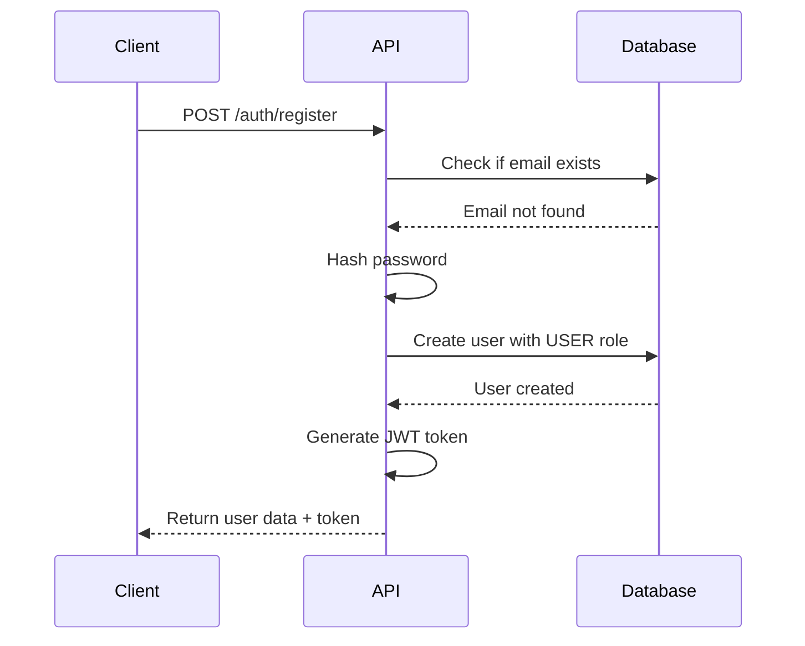
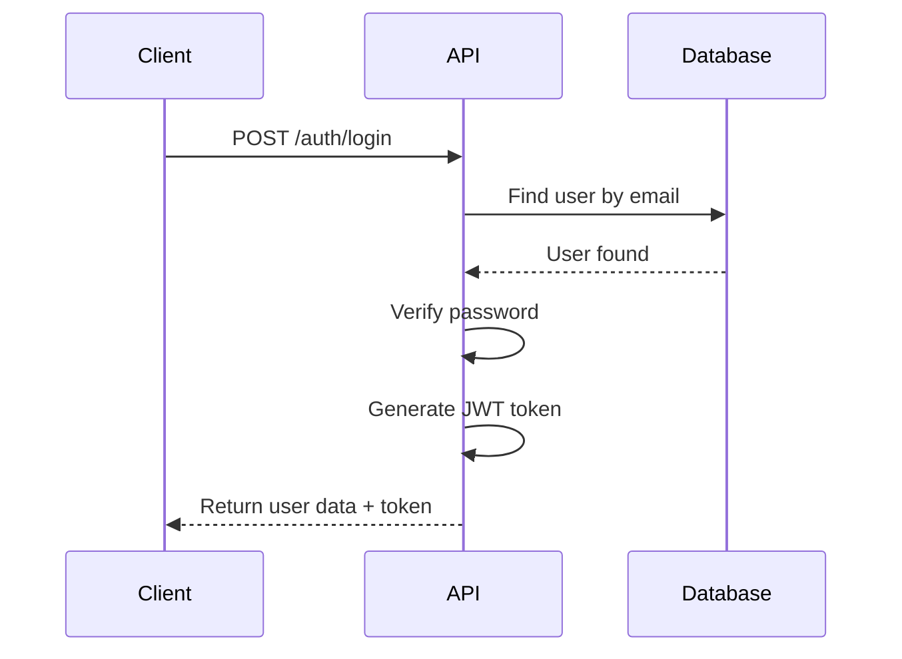

# Authentication API Documentation

## Overview
Authentication API cung cấp các endpoint để đăng ký, đăng nhập, đăng xuất và quản lý xác thực người dùng.

**Base URL:** `http://localhost:3000/api/v1/auth`

## Endpoints

### 1. Register User
Đăng ký tài khoản người dùng mới.

**Endpoint:** `POST /api/v1/auth/register`

**Request Body:**
```json
{
  "email": "user@example.com",
  "name": "John Doe",
  "password": "Password123"
}
```

**Validation Rules:**
- `email`: Required, valid email format
- `name`: Required, minimum 2 characters
- `password`: Required, minimum 8 characters, must contain uppercase, lowercase, and number

**Response:**
```json
{
  "message": "User registered successfully",
  "access_token": "eyJhbGciOiJIUzI1NiIsInR5cCI6IkpXVCJ9...",
  "user": {
    "id": "123e4567-e89b-12d3-a456-426614174000",
    "email": "user@example.com",
    "name": "John Doe"
  }
}
```

**Status Codes:**
- `201`: User registered successfully
- `400`: Bad request - validation failed
- `409`: Email already exists

### 2. Login User
Đăng nhập với email và password.

**Endpoint:** `POST /api/v1/auth/login`

**Request Body:**
```json
{
  "email": "user@example.com",
  "password": "Password123"
}
```

**Validation Rules:**
- `email`: Required, valid email format
- `password`: Required, minimum 8 characters

**Response:**
```json
{
  "message": "Login successful",
  "access_token": "eyJhbGciOiJIUzI1NiIsInR5cCI6IkpXVCJ9...",
  "user": {
    "id": "123e4567-e89b-12d3-a456-426614174000",
    "email": "user@example.com",
    "name": "John Doe"
  }
}
```

**Status Codes:**
- `200`: Login successful
- `400`: Bad request - validation failed
- `401`: Invalid credentials

### 3. Logout User
Đăng xuất người dùng.

**Endpoint:** `POST /api/v1/auth/logout`

**Headers:**
```
Authorization: Bearer <access_token>
```

**Response:**
```json
{
  "message": "Logout successful"
}
```

**Status Codes:**
- `200`: Logout successful

## Authentication Flow

### 1. Registration Flow


### 2. Login Flow


## Security Features

### Password Requirements
- Minimum 8 characters
- Must contain at least one uppercase letter
- Must contain at least one lowercase letter
- Must contain at least one number

### JWT Token
- **Expiration:** 30 days (configurable)
- **Algorithm:** HS256
- **Payload includes:** user ID, issued at, issuer

### Password Hashing
- **Algorithm:** bcrypt
- **Salt Rounds:** 12

## Error Handling

### Common Error Responses

**Validation Error (400):**
```json
{
  "statusCode": 400,
  "message": [
    "Please provide a valid email address",
    "Password must be at least 8 characters long"
  ],
  "error": "Bad Request"
}
```

**Conflict Error (409):**
```json
{
  "statusCode": 409,
  "message": "Email already exists",
  "error": "Conflict"
}
```

**Unauthorized Error (401):**
```json
{
  "statusCode": 401,
  "message": "Invalid credentials",
  "error": "Unauthorized"
}
```

## Testing with cURL

### Register User
```bash
curl -X POST http://localhost:3000/api/v1/auth/register \
  -H "Content-Type: application/json" \
  -d '{
    "email": "test@example.com",
    "name": "Test User",
    "password": "Password123"
  }'
```

### Login User
```bash
curl -X POST http://localhost:3000/api/v1/auth/login \
  -H "Content-Type: application/json" \
  -d '{
    "email": "test@example.com",
    "password": "Password123"
  }'
```

### Logout User
```bash
curl -X POST http://localhost:3000/api/v1/auth/logout \
  -H "Authorization: Bearer YOUR_JWT_TOKEN"
```

## Rate Limiting
Currently no rate limiting implemented. Consider implementing rate limiting for production use.

## Notes
- All new users are automatically assigned the `USER` role
- JWT tokens are stateless and do not require server-side storage
- Password is hashed using bcrypt before storing in database
- Email addresses must be unique across the system
